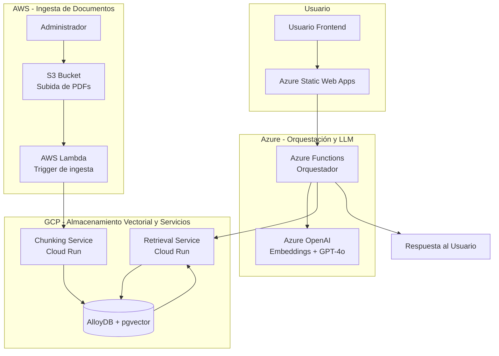

# 📚 CODEA RAG – Consultas sobre Pensión de Alimentos en Perú

[](#)
[](#)
[](#)
[](#)
[](#)
[](#)

---

## 👤 Autor

**David Yurvilca**  
*Estudiante del Programa de AI/LLM Solution Architect*  
*Curso: Diseño de Infraestructura Escalable*  
*Institución: BSG Institute*  
*Profesor: Msc, PgP, Andrés Felipe Rojas Parra*

---

## 📖 Descripción General del Proyecto

**CODEA** es una plataforma RAG (Retrieval-Augmented Generation) serverless multi‑cloud diseñada para responder preguntas en lenguaje natural sobre la **pensión de alimentos en Perú**. Los ciudadanos pueden realizar consultas y obtener respuestas basadas en normas legales oficiales (leyes, decretos, códigos, resoluciones), con citas textuales de las fuentes.

La plataforma combina lo mejor de tres proveedores cloud:

| Proveedor | Servicios utilizados |
|-----------|----------------------|
| **Azure** | Azure Functions (orquestador), Azure OpenAI (embeddings y chat), Azure Static Web Apps (frontend) |
| **AWS** | S3 (almacenamiento de PDFs), Lambda (ingesta automática) |
| **GCP** | AlloyDB + pgvector (base de datos vectorial), Cloud Run (chunking y retrieval) |

---

## 🌐 Acceso a la Aplicación

| Componente | URL / Acceso |
|------------|--------------|
| **Frontend (Usuario final)** | [https://victorious-tree-02708ac0f.7.azurestaticapps.net/](https://victorious-tree-02708ac0f.7.azurestaticapps.net/) |
| **API Orquestador (Azure Function)** | `https://[tu-nombre].azurewebsites.net` *(configurar en despliegue)* |
| **Retrieval Service (GCP Cloud Run)** | `https://retrieval-service-[hash].run.app` *(configurar en despliegue)* |
| **Chunking Service (GCP Cloud Run)** | `https://chunking-service-[hash].run.app` *(configurar en despliegue)* |
| **Bucket S3 (Ingesta)** | `s3://codea-docs-ingesta` *(privado)* |
| **AlloyDB (GCP)** | `[IP_PUBLICA]:5432` *(acceso restringido)* |

---

## 🎯 Caso de Uso a Solucionar

En Perú, el proceso de pensión de alimentos es un tema jurídico complejo que involucra múltiples normas legales (Código Civil, Código de los Niños y Adolescentes, leyes específicas, decretos, resoluciones). Los ciudadanos que necesitan información sobre este tema enfrentan varias dificultades:

- **Acceso limitado a la información legal**: Las normas están dispersas en diferentes documentos y portales.
- **Lenguaje jurídico complejo**: Los textos legales son difíciles de entender para el ciudadano promedio.
- **Actualización constante**: Las normas cambian y es difícil mantenerse al día.
- **Falta de herramientas accesibles**: No existen plataformas gratuitas y fáciles de usar para consultar este tipo de información.

**CODEA RAG** resuelve estos problemas al:

1. **Centralizar** las normas legales en una base de datos vectorial.
2. **Permitir consultas en lenguaje natural**, sin necesidad de conocer tecnicismos legales.
3. **Generar respuestas** con citas textuales de las fuentes, para que el usuario pueda verificar la información.
4. **Automatizar la ingesta** de nuevos documentos, manteniendo la base de conocimiento actualizada.

### KPIs Definidos

| KPI | Descripción |
|-----|-------------|
| **Latencia total del flujo** | Tiempo desde la consulta del usuario hasta la respuesta final. |
| **Tokens/s en inferencia** | Rendimiento del modelo LLM (Azure OpenAI). |
| **Costo por 1k tokens** | Costo de operación del LLM y embeddings. |
| **Tasa de aciertos RAG (RAGAS)** | Precisión del sistema de recuperación y generación (meta ≥ 0.7). |
| **Cloud egress cost** | Costos de transferencia de datos entre nubes (optimización). |

---

## 🎥 Video de Presentación

📽️ **Video de presentación del proyecto:**  
[https://docs.google.com/presentation/d/1pbYLm9DBwf0ocX7UEz78iUbAbPO1VoSt/edit?usp=drive_link&ouid=108325222194450107540&rtpof=true&sd=true](https://docs.google.com/presentation/d/1pbYLm9DBwf0ocX7UEz78iUbAbPO1VoSt/edit?usp=drive_link&ouid=108325222194450107540&rtpof=true&sd=true)

---

## 🏗️ Arquitectura del Sistema

El sistema está compuesto por cuatro componentes principales distribuidos en tres nubes:



### Flujo de Datos (Pipeline RAG Distribuido)

1.  **Ingesta de Documentos:** Un administrador sube un PDF al bucket S3 de AWS.
    
2.  **Procesamiento (AWS Lambda):** Lambda se activa y envía el PDF al _Chunking Service_ en GCP.
    
3.  **Chunking (GCP Cloud Run):** El servicio fragmenta el texto en trozos (chunks) con tamaño y solapamiento configurables.
    
4.  **Embeddings (Azure OpenAI):** Se generan vectores numéricos (embeddings) para cada chunk.
    
5.  **Vector Store (GCP AlloyDB + pgvector):** Los embeddings se almacenan con metadatos.
    
6.  **Consulta de Usuario:** El usuario hace una pregunta desde el frontend (Azure Static Web Apps).
    
7.  **Orquestación (Azure Functions):** Recibe la pregunta y la envía al _Retrieval Service_.
    
8.  **Retrieval (GCP Cloud Run):** Busca los chunks más similares por similitud coseno.
    
9.  **Generación (Azure OpenAI):** Se construye un prompt con los chunks recuperados y el LLM genera la respuesta final con citas `[1]`, `[2]`, etc.
    
10.  **Respuesta:** El frontend muestra la respuesta al usuario.


## 📋 Cumplimiento de Requisitos del Proyecto (Rúbrica)

A continuación se mapea cada punto obligatorio del proyecto con su estado y el documento donde se desarrolla en detalle:

| # | Componente del Proyecto | Estado | Documento / Sección de Referencia |
| --- | --- | --- | --- |
| 1 | **Definición del Caso de Uso (LLM)** | ✅ Completado | Sección "Caso de Uso" y "KPIs" de este README |
| 2 | **Selección del Modelo + Infraestructura** | ✅ Completado | `docs/seleccion-modelo-infraestructura.md`_(pendiente de crear)_ |
| 3 | **Patrón de Diseño LLM** | ⏳ Pendiente | `docs/patron-diseno-llm.md`_(pendiente de crear)_ |
| 4 | **Contenerización (Docker)** | ✅ Parcial | `gcp-services/chunking-service/Dockerfile` y `gcp-services/retrieval-service/Dockerfile`; documentación en `docs/contenizacion.md`_(pendiente)_ |
| 5 | **Orquestación Serverless Multicloud** | ✅ Completado | READMEs de `azure-function/`, `aws-lambda-ingesta/`, `gcp-services/` |
| 6 | **Arquitectura Multicloud (Diagrama)** | ✅ Completado | Diagrama Mermaid en este README y `docs/arquitectura.mermaid` |
| 7 | **Diseño del Pipeline RAG Distribuido** | ✅ Completado | Flujo de datos en este README y `docs/pipeline-rag.md`_(pendiente de detallar)_ |
| 8 | **Serving del LLM (Azure OpenAI)** | ✅ Completado | `azure-function/README.md` y `docs/serving-llm.md`_(pendiente)_ |
| 9 | **CI/CD Multinube** | ⏳ Pendiente | `docs/ci-cd.md` y workflows en `.github/workflows/`_(pendiente)_ |
| 10 | **Optimización de Costos (FinOps)** | ⏳ Pendiente | `docs/costos.md`_(pendiente de crear)_ |
| 11 | **Observabilidad y Métricas Cross-Cloud** | ⏳ Pendiente | `docs/observabilidad.md`_(pendiente de crear)_ |
| 12 | **Documentación Final Profesional** | ⏳ Pendiente | Documento integrador de 20-25 páginas (se construirá con todos los docs anteriores)  
  
 |


## 🛠️ Tecnologías Utilizadas

| Componente | Tecnología | Proveedor |
| --- | --- | --- |
| Frontend | React + Vite + Tailwind CSS | Azure Static Web Apps |
| Orquestador | Azure Functions (Python) | Azure |
| LLM y Embeddings | Azure OpenAI (GPT-4o, text-embedding-3) | Azure |
| Base de Datos Vectorial | PostgreSQL + pgvector | GCP AlloyDB |
| Servicios de Chunking y Retrieval | Cloud Run (Python/FastAPI) | GCP |
| Ingesta de Documentos | AWS Lambda (Python) | AWS |
| Almacenamiento de Documentos | AWS S3 | AWS |
| Evaluación | RAGAS Framework | Python |
| Despliegue | GitHub Actions (CI/CD) | GitHub |
| Observabilidad | Azure App Insights, AWS CloudWatch, GCP Cloud Logging | Multi-cloud |

* * *

## 📋 Estructura del Repositorio
```text
codea-rag/
├── .github/workflows/          # CI/CD (pendiente de definir)
├── docs/                       # Documentación del proyecto
│   ├── guia-usuario.md         # ⏳ Pendiente
│   ├── guia-administrador.md   # ⏳ Pendiente
│   ├── arquitectura.mermaid    # ✅ Diagrama base (refinar)
│   ├── costos.md               # ⏳ Pendiente (FinOps)
│   ├── observabilidad.md       # ⏳ Pendiente
│   ├── patron-diseno-llm.md    # ⏳ Pendiente
│   ├── seleccion-modelo-infraestructura.md # ⏳ Pendiente
│   ├── pipeline-rag.md         # ⏳ Pendiente
│   ├── contenerizacion.md      # ⏳ Pendiente
│   ├── ci-cd.md                # ⏳ Pendiente
│   ├── serving-llm.md          # ⏳ Pendiente
│   └── ragas-report.md         # ⏳ Pendiente (resultados 77%)
├── documentos-normas/          # PDFs fuente (normas legales)
│   ├── administrativa/         # Normas de derecho administrativo
│   ├── constitución/           # Constitución Política del Perú
│   ├── leyes/                  # Leyes y decretos legislativos
│   ├── penal/                  # Normas de derecho penal
│   └── README.md               # ✅ Explicación del formato
├── frontend/                   # React (Azure Static Web Apps)
│   ├── src/...
│   ├── package.json
│   ├── .env.example
│   └── README.md               # ✅ Completado
├── azure-function/             # Orquestador (Azure Functions Python)
│   ├── function_app.py
│   ├── host.json
│   ├── requirements.txt
│   └── README.md               # ✅ Completado
├── gcp-services/
│   ├── chunking-service/       # Fragmentación de texto (Cloud Run)
│   │   ├── app/...
│   │   ├── Dockerfile
│   │   ├── requirements.txt
│   │   └── README.md           # ✅ Completado
│   ├── retrieval-service/      # Búsqueda vectorial (Cloud Run)
│   │   ├── app/...
│   │   ├── Dockerfile
│   │   ├── requirements.txt
│   │   └── README.md           # ✅ Completado
│   └── README.md               # ⚠️ Pendiente (opcional)
├── aws-lambda-ingesta/         # Ingesta automática (AWS Lambda)
│   ├── lambda_function.py
│   ├── requirements.txt
│   ├── trust-policy.json
│   ├── deploy-aws-ingesta.sh
│   └── README.md               # ✅ Completado
├── sql/                        # Scripts de base de datos
│   ├── 01-create-extension-vector.sql
│   ├── 02-create-chunks-table.sql
│   ├── 03-create-documentos-metadata-table.sql
│   └── 04-create-indexes.sql
├── scripts/                    # Scripts de despliegue
│   ├── gcp/...
│   ├── azure/...
│   └── aws/...
├── tests/ragas/                # Pruebas de evaluación RAGAS
│   ├── questions.json
│   ├── test-rag.ps1
│   └── evaluate_ragas.py
├── .gitignore
├── LICENSE
└── README.md                   # ✅ Este archivo
```

## 📄 Documentos Normativos (Fuentes Legales)

Los PDFs fuente se encuentran en la carpeta [`documentos-normas/`](https://documentos-normas/README.md), organizados por área del derecho:

| Carpeta | Contenido |
| --- | --- |
| `administrativa/` | Normas de derecho administrativo (resoluciones, decretos, directivas) |
| `constitución/` | Texto de la Constitución Política del Perú |
| `leyes/` | Leyes ordinarias, decretos legislativos, decretos de urgencia |
| `penal/` | Normas de derecho penal y procesal penal |

Cada archivo sigue el formato: `[número o código de la norma]#[Título descriptivo].pdf`  
Ejemplo: `ley 26872#CONCILIACION.pdf`

Para más detalles, consulta el [README de documentos-normas](https://documentos-normas/README.md).

* * *

## 📖 Documentación Adicional

| Documento | Ubicación | Descripción |
| --- | --- | --- |
| 📘 **Guía de Usuario** | `docs/guia-usuario.md` | Cómo usar la aplicación, ejemplos de preguntas, interpretación de respuestas |
| 🛠️ **Guía de Administrador** | `docs/guia-administrador.md` | Despliegue, configuración, monitoreo, solución de problemas |
| 🏗️ **Diagrama de Arquitectura** | `docs/arquitectura.mermaid` | Diagrama detallado en Mermaid |
| 💰 **Análisis de Costos** | `docs/costos.md` | Estimación de costos mensuales, costo por request, estrategias de optimización |
| 📊 **Reporte RAGAS** | `docs/ragas-report.md` | Resultados de evaluación del sistema RAG (77% de acierto) |
| 🧩 Patrón de Diseño LLM** | `docs/patron-diseno-llm.md` | Justificación, trade-offs y diagrama del patrón seleccionado |
| 🐳 **Contenerización** | `docs/contenizacion.md` | Dockerfiles, multi-stage, seguridad (Trivy), buenas prácticas |
| 🔄 **CI/CD Multinube** | `docs/ci-cd.md` | Pipelines de GitHub Actions, Terraform/Bicep/CloudFormation |
| 🔍 **Observabilidad Cross-Cloud** | `docs/observabilidad.md` | App Insights, CloudWatch, Cloud Logging, trazabilidad y métricas |
| ⚙️ **Selección del Modelo** | `docs/seleccion-modelo-infraestructura.md` | Justificación de Azure OpenAI vs Bedrock, latencia, costos |
| 🧪 **Pipeline RAG Distribuido** | `docs/pipeline-rag.md` | Detalle técnico de chunking, embeddings, retrieval y reranking  |

### READMEs por Componente

| Componente | README | Estado |
| --- | --- | --- |
| **Frontend** | `frontend/README.md` | ✅ Completado |
| **Azure Function (orquestador)** | `azure-function/README.md` | ✅ Completado |
| **AWS Lambda (ingesta)** | `aws-lambda-ingesta/README.md` | ✅ Completado |
| **Chunking Service (GCP)** | `gcp-services/chunking-service/README.md` | ✅ Completado |
| **Retrieval Service (GCP)** | `gcp-services/retrieval-service/README.md` | ✅ Completado |
| **Documentos Normativos** | `documentos-normas/README.md` | ✅ Completado |

* * *

## 🚀 Instalación y Despliegue Rápido

### Prerrequisitos

-   Cuentas en **Azure**, **AWS** y **GCP** con los servicios configurados.
    
-   **Azure OpenAI** con acceso a GPT-4o y text-embedding-3.
    
-   **AlloyDB** en GCP con la extensión `pgvector` habilitada.
    
-   **Bucket S3** en AWS para la ingesta de documentos.
    
-   Herramientas: Git, Node.js (v18+), Python (v3.10+), Azure CLI, AWS CLI, gcloud CLI, Docker.
    

### Pasos

1.  Clonar el repositorio
```bash
git clone https://github.com/tu-usuario/codea-rag.git
cd codea-rag
```

2.  Configurar variables de entorno  
    Crea un archivo `.env` en la raíz con las variables necesarias (consulta los READMEs de cada componente para los detalles).
    
3.  Desplegar la base de datos  
    Ejecuta los scripts SQL en la carpeta `sql/` para crear la extensión `vector`, las tablas y los índices.
    
4.  Desplegar los servicios de GCP  
    Sigue las instrucciones en `gcp-services/chunking-service/README.md` y `gcp-services/retrieval-service/README.md`.
    
5.  Desplegar la AWS Lambda  
    Ejecuta `aws-lambda-ingesta/deploy-aws-ingesta.sh` para desplegar la Lambda y configurar el trigger de S3.
    
6.  Desplegar la Azure Function  
    Sigue las instrucciones en `azure-function/README.md`.
    
7.  Desplegar el frontend
```bash
cd frontend
npm install
npm run build
# Desplegar con Azure CLI o GitHub Actions
```

## 🧪 Evaluación y Pruebas

El proyecto incluye un conjunto de pruebas con RAGAS para medir la precisión del sistema:

```bash
cd tests/ragas
python evaluate_ragas.py
```
### Los resultados actuales muestran un 77% de acierto en las respuestas generadas (cumple con el mínimo de RAGAS ≥ 0.7 exigido).


## 🤝 Contribuciones

Las contribuciones son bienvenidas. Por favor:

1.  Haz un fork del repositorio.
    
2.  Crea una rama para tu característica (`git checkout -b feature/nueva-funcionalidad`).
    
3.  Realiza tus cambios y haz commit (`git commit -m 'Añade nueva funcionalidad'`).
    
4.  Sube los cambios (`git push origin feature/nueva-funcionalidad`).
    
5.  Abre un Pull Request.

##   

* * *

## 📄 Licencia

Este proyecto está licenciado bajo la MIT License. Consulta el archivo `LICENSE` para más detalles.

* * *

## 📞 Contacto y Soporte

-   Issues: [Issue Tracker](https://github.com/systemyuri/codea-rag-multinube/issues)
    
-   Correo: systemyuri@gmail.com