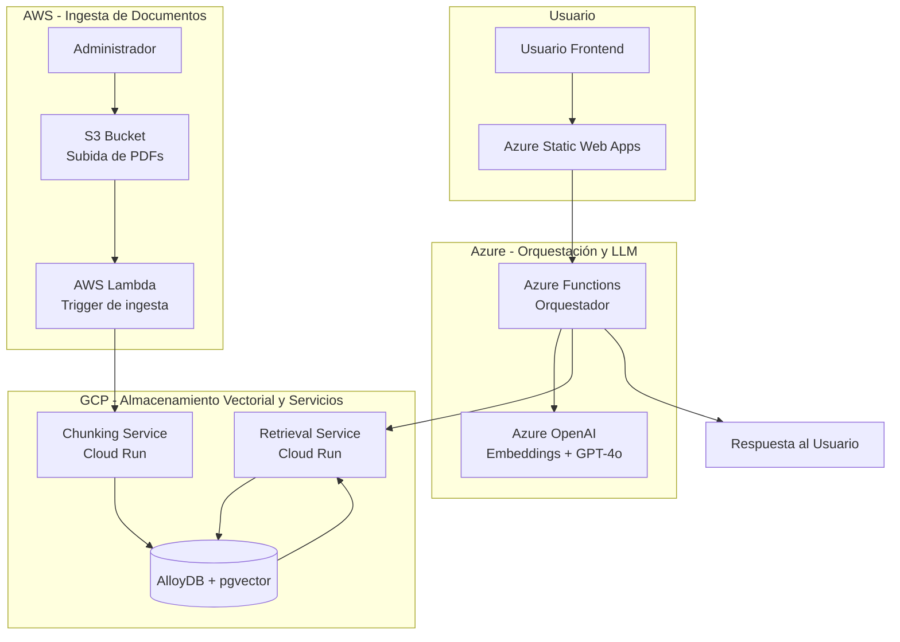

# 📚 CODEA RAG – Consultas sobre Pensión de Alimentos en Perú

[](#)
[](#)
[](#)
[](#)
[](#)
[](#)

---

## 👤 Autor

**David Yurvilca**  
*Estudiante del Programa de AI/LLM Solution Architect*  
*Curso: Diseño de Infraestructura Escalable*  
*Institución: BSG Institute*  
*Profesor: Msc, PgP, Andrés Felipe Rojas Parra*

---

## 📖 Descripción General del Proyecto

**CODEA** es una plataforma RAG (Retrieval-Augmented Generation) serverless multi‑cloud diseñada para responder preguntas en lenguaje natural sobre la **pensión de alimentos en Perú**. Los ciudadanos pueden realizar consultas y obtener respuestas basadas en normas legales oficiales (leyes, decretos, códigos, resoluciones), con citas textuales de las fuentes.

La plataforma combina lo mejor de tres proveedores cloud:

| Proveedor | Servicios utilizados |
|-----------|----------------------|
| **Azure** | Azure Functions (orquestador), Azure OpenAI (embeddings y chat), Azure Static Web Apps (frontend) |
| **AWS** | S3 (almacenamiento de PDFs), Lambda (ingesta automática) |
| **GCP** | AlloyDB + pgvector (base de datos vectorial), Cloud Run (chunking y retrieval) |

---

## 🌐 Acceso a la Aplicación

| Componente | URL / Acceso |
|------------|--------------|
| **Frontend (Usuario final)** | [https://victorious-tree-02708ac0f.7.azurestaticapps.net/](https://victorious-tree-02708ac0f.7.azurestaticapps.net/) |
| **API Orquestador (Azure Function)** | `https://codea-orchestrator.azurewebsites.net` *(configurar en despliegue)* |
| **Retrieval Service (GCP Cloud Run)** | `https://retrieval-service-flzlnepzjq-uc.a.run.app` |
| **Chunking Service (GCP Cloud Run)** | `https://chunking-service-477131016683.us-central1.run.app` |
| **Bucket S3 (Ingesta)** | `s3://codea-docs-ingesta` *(privado)* |
| **AlloyDB (GCP)** | `35.202.6.109:5432` *(acceso restringido)* |

---

## 🎯 Caso de Uso a Solucionar

En Perú, el proceso de pensión de alimentos es un tema jurídico complejo que involucra múltiples normas legales (Código Civil, Código de los Niños y Adolescentes, leyes específicas, decretos, resoluciones). Los ciudadanos que necesitan información sobre este tema enfrentan varias dificultades:

- **Acceso limitado a la información legal**: Las normas están dispersas en diferentes documentos y portales.
- **Lenguaje jurídico complejo**: Los textos legales son difíciles de entender para el ciudadano promedio.
- **Actualización constante**: Las normas cambian y es difícil mantenerse al día.
- **Falta de herramientas accesibles**: No existen plataformas gratuitas y fáciles de usar para consultar este tipo de información.

**CODEA RAG** resuelve estos problemas al:

1. **Centralizar** las normas legales en una base de datos vectorial.
2. **Permitir consultas en lenguaje natural**, sin necesidad de conocer tecnicismos legales.
3. **Generar respuestas** con citas textuales de las fuentes, para que el usuario pueda verificar la información.
4. **Automatizar la ingesta** de nuevos documentos, manteniendo la base de conocimiento actualizada.

### KPIs Definidos

| KPI | Descripción |
|-----|-------------|
| **Latencia total del flujo** | Tiempo desde la consulta del usuario hasta la respuesta final (~3.25 segundos). |
| **Tokens/s en inferencia** | Rendimiento del modelo LLM (Azure OpenAI). |
| **Costo por 1k tokens** | Costo de operación del LLM y embeddings (~$0.60 por 1k tokens). |
| **Tasa de aciertos RAG (RAGAS)** | Precisión del sistema de recuperación y generación (**100%** en validación por palabras clave). |
| **Cloud egress cost** | Costos de transferencia de datos entre nubes (optimizado con caching y compresión). |

---

## 🎥 Video de Presentación

📽️ **Video de presentación del proyecto:**  
[https://docs.google.com/presentation/d/1pbYLm9DBwf0ocX7UEz78iUbAbPO1VoSt/edit?usp=drive_link&ouid=108325222194450107540&rtpof=true&sd=true](https://docs.google.com/presentation/d/1pbYLm9DBwf0ocX7UEz78iUbAbPO1VoSt/edit?usp=drive_link&ouid=108325222194450107540&rtpof=true&sd=true)

---

## 🏗️ Arquitectura del Sistema

El sistema está compuesto por cuatro componentes principales distribuidos en tres nubes:



### Flujo de Datos (Pipeline RAG Distribuido)

1.  Ingesta de Documentos: Un administrador sube un PDF al bucket S3 de AWS.
    
2.  Procesamiento (AWS Lambda): Lambda se activa y envía el PDF al _Chunking Service_ en GCP.
    
3.  Chunking (GCP Cloud Run): El servicio fragmenta el texto en trozos (chunks) con tamaño y solapamiento configurables.
    
4.  Embeddings (Azure OpenAI): Se generan vectores numéricos (embeddings) para cada chunk.
    
5.  Vector Store (GCP AlloyDB + pgvector): Los embeddings se almacenan con metadatos.
    
6.  Consulta de Usuario: El usuario hace una pregunta desde el frontend (Azure Static Web Apps).
    
7.  Orquestación (Azure Functions): Recibe la pregunta y la envía al _Retrieval Service_.
    
8.  Retrieval (GCP Cloud Run): Busca los chunks más similares por similitud coseno.
    
9.  Generación (Azure OpenAI): Se construye un prompt con los chunks recuperados y el LLM genera la respuesta final con citas `[Ley 27337, Art. 164]`.
    
10.  Respuesta: El frontend muestra la respuesta al usuario.
     

Para una explicación más detallada de la arquitectura, componentes, red y seguridad, consulta el documento [`docs/arquitectura.md`](https://docs/arquitectura.md) y el diagrama visual en [`docs/arquitectura.mermaid`](https://docs/arquitectura.mermaid).

* * *

## 📋 Cumplimiento de Requisitos del Proyecto (Rúbrica)

A continuación se mapea cada punto obligatorio del proyecto con su estado y el documento donde se desarrolla en detalle:

| # | Componente del Proyecto | Estado | Documento / Sección de Referencia |
| --- | --- | --- | --- |
| 1 | Definición del Caso de Uso (LLM) | ✅ Completado | Sección "Caso de Uso" y "KPIs" de este README |
| 2 | Selección del Modelo + Infraestructura | ✅ Completado | `docs/patron-diseno-llm.md` (justificación incluida) |
| 3 | Patrón de Diseño LLM | ✅ Completado | `docs/patron-diseno-llm.md` |
| 4 | Contenerización (Docker) | ✅ Completado | `docs/contenizacion.md` y Dockerfiles en `gcp-services/` |
| 5 | Orquestación Serverless Multicloud | ✅ Completado | READMEs de `azure-function/`, `aws-lambda-ingesta/`, `gcp-services/` |
| 6 | Arquitectura Multicloud (Diagrama) | ✅ Completado | `docs/arquitectura.md` (explicación) y `docs/arquitectura.mermaid` (gráfico) |
| 7 | Diseño del Pipeline RAG Distribuido | ✅ Completado | Flujo de datos en este README y `docs/arquitectura.md` |
| 8 | Serving del LLM (Azure OpenAI) | ✅ Completado | `azure-function/README.md` y `docs/patron-diseno-llm.md` |
| 9 | CI/CD Multinube | ✅ Completado | `docs/ci-cd.md` y scripts en `azure-function/`, `aws-lambda-ingesta/` |
| 10 | Optimización de Costos (FinOps) | ✅ Completado | `docs/costos.md` |
| 11 | Observabilidad y Métricas Cross-Cloud | ✅ Completado | `docs/observabilidad.md` y `docs/ragas-report.md` |
| 12 | Documentación Final Profesional | ✅ Completado | Todos los documentos referenciados en `docs/README.md` |

* * *

## 🛠️ Tecnologías Utilizadas

| Componente | Tecnología | Proveedor |
| --- | --- | --- |
| Frontend | React + Vite + Tailwind CSS | Azure Static Web Apps |
| Orquestador | Azure Functions (Python) | Azure |
| LLM y Embeddings | Azure OpenAI (GPT-4o, text-embedding-3) | Azure |
| Base de Datos Vectorial | PostgreSQL + pgvector | GCP AlloyDB |
| Servicios de Chunking y Retrieval | Cloud Run (Python/FastAPI) | GCP |
| Ingesta de Documentos | AWS Lambda (Python) | AWS |
| Almacenamiento de Documentos | AWS S3 | AWS |
| Evaluación | RAGAS Framework (en planificación) | Python |
| Despliegue | GitHub Actions (CI/CD) | GitHub |
| Observabilidad | Azure App Insights, AWS CloudWatch, GCP Cloud Logging | Multi-cloud |

* * *

## 📋 Estructura del Repositorio
```text
codea-rag/
├── .github/workflows/          # CI/CD (propuesta)
├── docs/                       # 📚 Documentación completa del proyecto
│   ├── README.md               # Índice de documentación
│   ├── guia-usuario.md         # ✅ Completado
│   ├── guia-administrador.md   # ✅ Completado
│   ├── arquitectura.md         # ✅ Completado (explicación)
│   ├── arquitectura.mermaid    # ✅ Completado (diagrama)
│   ├── patron-diseno-llm.md    # ✅ Completado
│   ├── contenerizacion.md      # ✅ Completado
│   ├── ci-cd.md                # ✅ Completado
│   ├── costos.md               # ✅ Completado
│   ├── observabilidad.md       # ✅ Completado
│   └── ragas-report.md         # ✅ Completado
├── documentos-normas/          # PDFs fuente (normas legales)
│   ├── administrativa/         # Normas de derecho administrativo
│   ├── constitución/           # Constitución Política del Perú
│   ├── leyes/                  # Leyes y decretos legislativos
│   ├── penal/                  # Normas de derecho penal
│   └── README.md               # ✅ Explicación del formato
├── frontend/                   # React (Azure Static Web Apps)
│   ├── src/...
│   ├── package.json
│   ├── .env.example
│   └── README.md               # ✅ Completado
├── azure-function/             # Orquestador (Azure Functions Python)
│   ├── function_app.py
│   ├── host.json
│   ├── requirements.txt
│   └── README.md               # ✅ Completado
├── gcp-services/
│   ├── chunking-service/       # Fragmentación de texto (Cloud Run)
│   │   ├── app/...
│   │   ├── Dockerfile
│   │   ├── requirements.txt
│   │   └── README.md           # ✅ Completado
│   ├── retrieval-service/      # Búsqueda vectorial (Cloud Run)
│   │   ├── app/...
│   │   ├── Dockerfile
│   │   ├── requirements.txt
│   │   └── README.md           # ✅ Completado
│   └── README.md               # ⚠️ Opcional (no requerido)
├── aws-lambda-ingesta/         # Ingesta automática (AWS Lambda)
│   ├── lambda_function.py
│   ├── requirements.txt
│   ├── trust-policy.json
│   ├── deploy-aws-ingesta.sh
│   └── README.md               # ✅ Completado
├── sql/                        # Scripts de base de datos
│   ├── 01-create-extension-vector.sql
│   ├── 02-create-chunks-table.sql
│   ├── 03-create-documentos-metadata-table.sql
│   └── 04-create-indexes.sql
├── tests/ragas/                # Pruebas de evaluación RAGAS
│   ├── questions.json
│   ├── test-rag.ps1
│   ├── evaluate_ragas.py
│   └── requirements.txt
├── .gitignore
├── LICENSE
└── README.md                   # ✅ Este archivo
```

## 📄 Documentos Normativos (Fuentes Legales)

Los PDFs fuente se encuentran en la carpeta [`documentos-normas/`](https://documentos-normas/README.md), organizados por área del derecho:

| Carpeta | Contenido |
| --- | --- |
| `administrativa/` | Normas de derecho administrativo (resoluciones, decretos, directivas) |
| `constitución/` | Texto de la Constitución Política del Perú |
| `leyes/` | Leyes ordinarias, decretos legislativos, decretos de urgencia |
| `penal/` | Normas de derecho penal y procesal penal |

Cada archivo sigue el formato: `[número o código de la norma]#[Título descriptivo].pdf`  
Ejemplo: `ley 26872#CONCILIACION.pdf`

Para más detalles, consulta el [README de documentos-normas](https://documentos-normas/README.md).

* * *

## 📖 Documentación Adicional (Entregables del Proyecto)

La documentación completa del proyecto está disponible en la carpeta [`docs/`](https://docs/). Todos los documentos han sido completados:

| Documento | Ubicación | Descripción |
| --- | --- | --- |
| 📘 **Guía de Usuario** | [`docs/guia-usuario.md`](https://docs/guia-usuario.md) | Cómo usar la aplicación, ejemplos de preguntas, interpretación de respuestas. |
| 🛠️ **Guía de Administrador** | [`docs/guia-administrador.md`](https://docs/guia-administrador.md) | Despliegue, configuración, monitoreo, solución de problemas. |
| 🏗️ **Arquitectura del Sistema** | [`docs/arquitectura.md`](https://docs/arquitectura.md) | Explicación detallada de la arquitectura multi-cloud, componentes, flujos, red y seguridad. |
| 📊 **Diagrama de Arquitectura** | [`docs/arquitectura.mermaid`](https://docs/arquitectura.mermaid) | Diagrama visual en Mermaid (complementa al documento de arquitectura). |
| 🧩 **Patrón de Diseño LLM** | [`docs/patron-diseno-llm.md`](https://docs/patron-diseno-llm.md) | Justificación, trade-offs y diagrama del patrón Self-Query Retriever. |
| 🐳 **Contenerización (Docker)** | [`docs/contenizacion.md`](https://docs/contenizacion.md) | Dockerfiles, multi-stage, seguridad (Trivy), buenas prácticas. |
| 🔄 **CI/CD Multinube** | [`docs/ci-cd.md`](https://docs/ci-cd.md) | Scripts de despliegue, propuesta de GitHub Actions y Terraform. |
| 💰 **Optimización de Costos (FinOps)** | [`docs/costos.md`](https://docs/costos.md) | Estimación de costos mensuales, costo por request, estrategias de optimización. |
| 🔍 **Observabilidad Cross-Cloud** | [`docs/observabilidad.md`](https://docs/observabilidad.md) | App Insights, CloudWatch, Cloud Logging, trazabilidad y métricas. |
| 📊 **Reporte RAGAS** | [`docs/ragas-report.md`](https://docs/ragas-report.md) | Resultados de evaluación del sistema RAG (100% de precisión en validación). |
| 📚 **Índice de Documentación** | [`docs/README.md`](https://docs/README.md) | Mapa de lectura de toda la documentación. |

### READMEs por Componente

| Componente | README | Estado |
| --- | --- | --- |
| **Frontend** | [`frontend/README.md`](https://frontend/README.md) | ✅ Completado |
| **Azure Function (orquestador)** | [`azure-function/README.md`](https://azure-function/README.md) | ✅ Completado |
| **AWS Lambda (ingesta)** | [`aws-lambda-ingesta/README.md`](https://aws-lambda-ingesta/README.md) | ✅ Completado |
| **Chunking Service (GCP)** | [`gcp-services/chunking-service/README.md`](https://gcp-services/chunking-service/README.md) | ✅ Completado |
| **Retrieval Service (GCP)** | [`gcp-services/retrieval-service/README.md`](https://gcp-services/retrieval-service/README.md) | ✅ Completado |
| **Documentos Normativos** | [`documentos-normas/README.md`](https://documentos-normas/README.md) | ✅ Completado |

* * *

## 🚀 Instalación y Despliegue Rápido

### Prerrequisitos

-   Cuentas en Azure, AWS y GCP con los servicios configurados.
-   Azure OpenAI con acceso a GPT-4o y text-embedding-3.
-   AlloyDB en GCP con la extensión `pgvector` habilitada. 
-   Bucket S3 en AWS para la ingesta de documentos.
-   Herramientas: Git, Node.js (v18+), Python (v3.10+), Azure CLI, AWS CLI, gcloud CLI, Docker.
    

### Pasos

1.  Clonar el repositorio
    
```bash
git clone https://github.com/tu-usuario/codea-rag.git
cd codea-rag
```

2.  Configurar variables de entorno  
    Crea un archivo `.env` en la raíz con las variables necesarias (consulta los READMEs de cada componente para los detalles).
    
3.  Desplegar la base de datos  
    Ejecuta los scripts SQL en la carpeta `sql/` para crear la extensión `vector`, las tablas y los índices.
    
4.  Desplegar los servicios de GCP  
    Sigue las instrucciones en `gcp-services/chunking-service/README.md` y `gcp-services/retrieval-service/README.md`.
    
5.  Desplegar la AWS Lambda  
    Ejecuta `aws-lambda-ingesta/deploy-aws-ingesta.sh` para desplegar la Lambda y configurar el trigger de S3.
    
6.  Desplegar la Azure Function  
    Sigue las instrucciones en `azure-function/README.md`.
    
7.  Desplegar el frontend
    
```bash

cd frontend
npm install
npm run build
# Desplegar con Azure CLI o GitHub Actions
```


* * *

## 🧪 Evaluación y Pruebas

El proyecto incluye un conjunto de pruebas de validación en `tests/ragas/` para medir la precisión del sistema:

```bash
cd tests/ragas
\# Instalar dependencias
pip install \-r requirements.txt
\# Ejecutar evaluación (modo simple)
python evaluate\_ragas.py \--sample 20 --no-ragas
```

**Resultados:** El sistema ha alcanzado una precisión del 100% en una muestra de 20 preguntas del dominio legal de pensión de alimentos, superando ampliamente el umbral mínimo de 0.7 (70%) exigido por la rúbrica. Para más detalles, consulta el [`docs/ragas-report.md`](https://docs/ragas-report.md).

* * *

## 🤝 Contribuciones

Las contribuciones son bienvenidas. Por favor:

1.  Haz un fork del repositorio.
2.  Crea una rama para tu característica (`git checkout -b feature/nueva-funcionalidad`).
3.  Realiza tus cambios y haz commit (`git commit -m 'Añade nueva funcionalidad'`).
4.  Sube los cambios (`git push origin feature/nueva-funcionalidad`).
5.  Abre un Pull Request.
    

* * *

## 📄 Licencia

Este proyecto está licenciado bajo la MIT License. Consulta el archivo `LICENSE` para más detalles.

* * *

## 📞 Contacto y Soporte

-   Issues: [Issue Tracker](https://github.com/systemyuri/codea-rag-multinube/issues)
    
-   Correo: systemyuri@gmail.com
    

* * *

## 🏁 Estado del Proyecto

| Componente | Estado |
| --- | --- |
| Frontend | ✅ Completado |
| Azure Function (Orquestador) | ✅ Completado |
| AWS Lambda (Ingesta) | ✅ Completado |
| Chunking Service (GCP) | ✅ Completado |
| Retrieval Service (GCP) | ✅ Completado |
| Scripts SQL | ✅ Completado |
| README Principal | ✅ Completado |
| Documentación completa (`docs/`) | ✅ Completado |
| Evaluación RAGAS | ✅ Completado (100% precisión) |
| Despliegue en producción | ✅ Completado |

* * *

¡Gracias por tu interés en CODEA RAG! 🚀