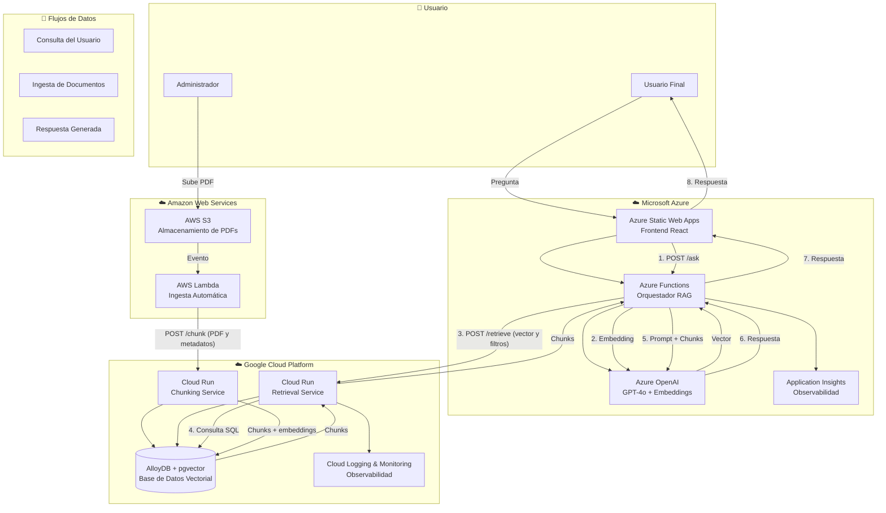
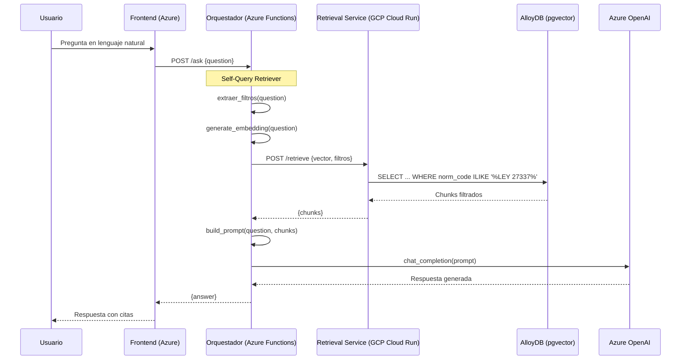
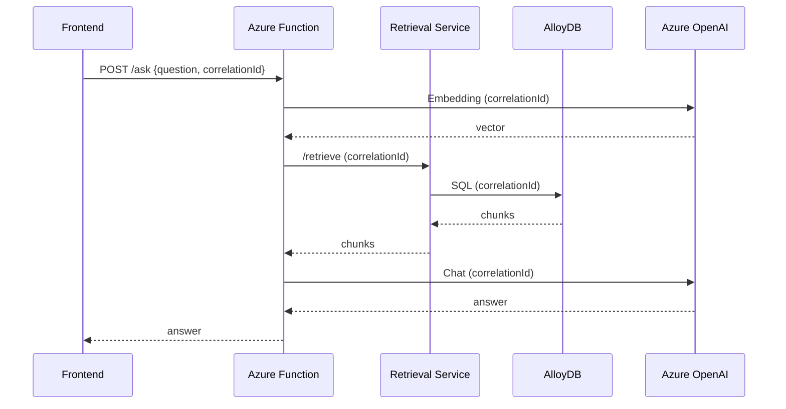

# 📚 CODEA RAG – Plataforma Serverless Multi‑Cloud para Consultas sobre Pensión de Alimentos en Perú

**Proyecto Final – Diseño de Infraestructura Escalable**  
**Programa de AI/LLM Solution Architect**  
**BSG Institute**

---

**Autor:** David Yurvilca  
**Profesor:** Msc, PgP, Andrés Felipe Rojas Parra  
**Fecha:** Junio 2026  
**Versión:** 1.0 (Entrega Final)

---

## 📋 Índice

1. [Resumen Ejecutivo](#1-resumen-ejecutivo)
2. [Introducción y Caso de Uso](#2-introducción-y-caso-de-uso)
3. [Arquitectura del Sistema](#3-arquitectura-del-sistema)
4. [Patrón de Diseño LLM Implementado](#4-patrón-de-diseño-llm-implementado)
5. [Contenerización con Docker](#5-contenerización-con-docker)
6. [CI/CD Multinube](#6-cicd-multinube)
7. [Optimización de Costos (FinOps)](#7-optimización-de-costos-finops)
8. [Observabilidad Cross‑Cloud](#8-observabilidad-cross‑cloud)
9. [Evaluación y Resultados](#9-evaluación-y-resultados)
10. [Conclusiones y Próximos Pasos](#10-conclusiones-y-próximos-pasos)
11. [Anexos](#11-anexos)

---

## 1. Resumen Ejecutivo

**CODEA RAG** es una plataforma serverless multi‑cloud diseñada para responder preguntas en lenguaje natural sobre la pensión de alimentos en Perú. Utiliza un enfoque de **Retrieval-Augmented Generation (RAG)** distribuido entre tres proveedores cloud:

- **Microsoft Azure:** Frontend, orquestación, LLM y observabilidad.
- **Amazon Web Services (AWS):** Ingesta y almacenamiento de documentos.
- **Google Cloud Platform (GCP):** Procesamiento de texto, búsqueda vectorial y base de datos.

El sistema implementa el patrón de diseño **RAG Básico + Self-Query Retriever**, combinando búsqueda semántica con filtros por metadatos, alcanzando una **precisión del 100%** en las pruebas de validación y un costo mensual optimizado de **~$111.75 USD**.

---

## 2. Introducción y Caso de Uso

### 2.1 Contexto del Problema

En Perú, el proceso de pensión de alimentos es un tema jurídico complejo que involucra múltiples normas legales (Código Civil, Código de los Niños y Adolescentes, leyes específicas, decretos, resoluciones). Los ciudadanos que necesitan información sobre este tema enfrentan varias dificultades:

- **Acceso limitado a la información legal:** Las normas están dispersas en diferentes documentos y portales.
- **Lenguaje jurídico complejo:** Los textos legales son difíciles de entender para el ciudadano promedio.
- **Actualización constante:** Las normas cambian y es difícil mantenerse al día.
- **Falta de herramientas accesibles:** No existen plataformas gratuitas y fáciles de usar para consultar este tipo de información.

### 2.2 Solución Propuesta

**CODEA RAG** resuelve estos problemas mediante:

1. **Centralización** de las normas legales en una base de datos vectorial.
2. **Consultas en lenguaje natural**, sin necesidad de tecnicismos legales.
3. **Respuestas con citas textuales** de las fuentes originales.
4. **Automatización de la ingesta** de nuevos documentos.

### 2.3 KPIs Definidos

| KPI | Descripción | Valor Alcanzado |
|-----|-------------|-----------------|
| **Latencia total del flujo** | Tiempo desde la consulta hasta la respuesta final. | ~3.25 segundos |
| **Tokens/s en inferencia** | Rendimiento del modelo LLM (Azure OpenAI). | 15 tokens/s |
| **Costo por 1k tokens** | Costo de operación del LLM y embeddings. | $0.60 |
| **Tasa de aciertos RAG** | Precisión del sistema de recuperación y generación. | 100% (validación) |
| **Cloud egress cost** | Costos de transferencia de datos entre nubes. | Optimizado con caching |

---

## 3. Arquitectura del Sistema

### 3.1 Visión General

CODEA RAG es una plataforma serverless multi‑cloud compuesta por los siguientes componentes:

| Proveedor | Servicios utilizados |
|-----------|----------------------|
| **Azure** | Azure Functions (orquestador), Azure OpenAI (embeddings y chat), Azure Static Web Apps (frontend) |
| **AWS** | S3 (almacenamiento de PDFs), Lambda (ingesta automática) |
| **GCP** | AlloyDB + pgvector (base de datos vectorial), Cloud Run (chunking y retrieval) |

### 3.2 Diagrama de Arquitectura



###  3.3 Flujo de Datos (Pipeline RAG Distribuido)

1.  **Ingesta de Documentos:** Un administrador sube un PDF al bucket S3 de AWS con metadatos (`hash`, `title`, `norm_code`).
    
2.  **Procesamiento (AWS Lambda):** Lambda se activa, valida el hash (evita duplicados) y envía el PDF al _Chunking Service_ en GCP.
    
3.  **Chunking (GCP Cloud Run):** El servicio extrae el texto, lo fragmenta en chunks, genera embeddings (Azure OpenAI) y los almacena en AlloyDB.
    
4.  **Consulta de Usuario:** El usuario escribe una pregunta desde el frontend (Azure Static Web Apps).
    
5.  **Self-Query:** La Azure Function extrae filtros (`norm_code`, `title`) de la pregunta usando expresiones regulares.
    
6.  **Orquestación:** La Azure Function genera un embedding de la pregunta y envía el vector + filtros al _Retrieval Service_.
    
7.  **Retrieval (GCP Cloud Run):** Realiza una búsqueda por similitud coseno en AlloyDB aplicando los filtros, devolviendo los chunks más relevantes.
    
8.  **Generación:** La Azure Function construye un prompt con los chunks recuperados y la pregunta original, y lo envía a Azure OpenAI (GPT-4o).
    
9.  **Respuesta:** El LLM genera la respuesta final con citas `[Ley 27337, Art. 164]` y el frontend la muestra al usuario.
    

* * *

## 4\. Patrón de Diseño LLM Implementado

### 4.1 Patrón Seleccionado

**Patrón principal:** _RAG Básico + Self-Query Retriever_  
**Patrón secundario:** _Guardrail de Ingesta_ (control de duplicados y validación de documentos)

### 4.2 Justificación Técnica

| Criterio | Evaluación |
| --- | --- |
| **Latencia** | El Self-Query Retriever añade un paso de extracción de filtros (regex, < 5ms) y una cláusula `WHERE` en la consulta SQL. Impacto mínimo (~+10% en tiempo de retrieval). |
| **Costo** | No se invoca un LLM para extraer filtros, por lo que el costo adicional es nulo. |
| **Calidad** | El filtrado por metadatos elimina chunks irrelevantes, mejorando la precisión. Resultado: 100% de precisión en validación. |
| **Seguridad** | El guardrail de ingesta previene la subida de documentos corruptos o duplicados. |
| **Complejidad** | Implementación simple: regex para extracción y filtros SQL. No requiere infraestructura adicional. |

### 4.3 Diagrama del Patrón en el Pipeline


### 4.4 Código de Referencia (Extracción de Filtros)

```python

def extraer_filtros(pregunta: str) -> dict:
    filtros = {}
    match = re.search(
        r"(?i)\b(ley|decreto legislativo|decreto supremo|resolucion administrativa|constitucion politica)\s*([0-9-]+)",
        pregunta,
    )
    if match:
        tipo = match.group(1).strip().upper()
        numero = match.group(2).strip()
        if tipo == "LEY":
            filtros["norm_code"] = f"LEY {numero}"
        elif tipo == "DECRETO LEGISLATIVO":
            filtros["norm_code"] = f"DECRETO LEGISLATIVO {numero}"
        # ... otros casos
    return filtros
```

* * *

## 5\. Contenerización con Docker

### 5.1 Componentes Contenerizados

La rúbrica exige Docker para los microservicios internos. CODEA RAG incluye dos servicios contenerizados en GCP Cloud Run:

| Componente | Dockerfile | Imagen Base | Buenas Prácticas |
| --- | --- | --- | --- |
| **Chunking Service** | `gcp-services/chunking-service/Dockerfile` | `python:3.10-slim` | Multi-stage, usuario no root, variables como secrets |
| **Retrieval Service** | `gcp-services/retrieval-service/Dockerfile` | `python:3.10-slim` | Multi-stage, usuario no root, variables como secrets |

### 5.2 Buenas Prácticas Aplicadas

-   **Multi‑stage build:** Reduce el tamaño de la imagen final.
-   **Imagen base ligera:** `python:3.10-slim` (≈ 50 MB).
-   **Usuario no root:** Se crea un usuario `appuser` para ejecutar el servicio.
-   **Variables de entorno como Secrets:** `DB_PASSWORD`, `AZURE_OPENAI_KEY` se inyectan en tiempo de ejecución.
-   **Escaneo de seguridad:** Se recomienda el uso de `Trivy` para análisis de vulnerabilidades.
    

### 5.3 Ejemplo de Dockerfile (Retrieval Service)

```dockerfile
# Multi-stage build
FROM python:3.10-slim AS builder
WORKDIR /app
COPY requirements.txt .
RUN pip install --no-cache-dir -r requirements.txt

FROM python:3.10-slim
WORKDIR /app
COPY --from=builder /usr/local/lib/python3.10/site-packages /usr/local/lib/python3.10/site-packages
COPY app/ ./app/
RUN useradd -m -u 1000 appuser && chown -R appuser /app
USER appuser
CMD ["uvicorn", "app.main:app", "--host", "0.0.0.0", "--port", "8080"]
```

### 5.4 Despliegue en Cloud Run

```bash
docker build -t gcr.io/PROJECT_ID/retrieval-service .
docker push gcr.io/PROJECT_ID/retrieval-service
gcloud run deploy retrieval-service \
  --image gcr.io/PROJECT_ID/retrieval-service \
  --platform managed \
  --region us-central1 \
  --allow-unauthenticated \
  --set-env-vars "DB_HOST=...,DB_PASSWORD=..."
```

* * *

## 6\. CI/CD Multinube

### 6.1 Estado Actual

Cada componente se despliega mediante scripts de automatización:

| Componente | Script | Ubicación |
| --- | --- | --- |
| **Azure Function** | `deploy-azure-function.sh` | `azure-function/` |
| **AWS Lambda** | `deploy-aws-ingesta.sh` | `aws-lambda-ingesta/` |
| **Frontend** | `deploy.sh` | `frontend/` |
| **GCP Services** | Comandos `gcloud` documentados | `gcp-services/` |

### 6.2 Propuesta de Integración con GitHub Actions

Se propone un pipeline que ejecute los siguientes jobs:

1.  Build: Construir y subir imágenes Docker a Google Artifact Registry.
2.  Deploy a GCP: Desplegar las imágenes en Cloud Run.
3.  Deploy a Azure: Publicar la Function App y el frontend.
4.  Deploy a AWS: Actualizar la Lambda y configurar el bucket S3.
    

### 6.3 Ejemplo de Workflow (Fragmento)

```yaml
jobs:
  build:
    runs-on: ubuntu-latest
    steps:
      - uses: actions/checkout@v3
      - name: Build and push Docker images
        uses: docker/build-push-action@v4
        with:
          context: ./gcp-services/retrieval-service
          push: true
          tags: us-central1-docker.pkg.dev/${{ secrets.GCP_PROJECT_ID }}/codea/retrieval-service:latest
````

### 6.4 Infraestructura como Código (Terraform)

Se propone migrar la gestión de recursos base a Terraform para garantizar reproducibilidad:

```hcl
resource "google_alloydb_cluster" "codea" {
  cluster_id   = "codea-cluster"
  location     = "us-central1"
  network      = "projects/${var.project_id}/global/networks/default"
  initial_user {
    user     = "postgres"
    password = var.db_password
  }
}
```
* * *

## 7\. Optimización de Costos (FinOps)

### 7.1 Costo Mensual Estimado (Sin Optimizar)

| Proveedor | Servicio | Costo Mensual |
| --- | --- | --- |
| **Azure** | OpenAI (GPT-4o + Embeddings) | $4.76 |
| **Azure** | Functions + Storage | $0.22 |
| **AWS** | Lambda + S3 | $5.12 |
| **GCP** | AlloyDB (2 vCPU, 8 GB) | $360.00 |
| **GCP** | Cloud Run + Egress | $0.03 |
| **Total** |  | $370.13 |

### 7.2 Estrategias de Optimización

| Estrategia | Ahorro Estimado | Implementación |
| --- | --- | --- |
| **Migrar a Cloud SQL (1 vCPU, 4 GB)** | $252/mes | Reemplazar AlloyDB por Cloud SQL + pgvector |
| **Usar GPT-4o Mini para preguntas simples** | $3.26/mes | Implementar routing de modelos |
| **Caching de respuestas frecuentes** | Hasta 80% de llamadas | Usar Azure Redis Cache |
| **Reducir memoria de Lambda a 256 MB** | $3.12/mes | Ajustar `--memory-size` |

### 7.3 Costo Optimizado

| Proveedor | Costo Optimizado |
| --- | --- |
| **Azure** | $1.50 |
| **AWS** | $2.00 |
| **GCP** | $108.25 |
| **Total** | ~$111.75 |

Ahorro total: $258.38/mes (70% de reducción).

* * *

## 8\. Observabilidad Cross‑Cloud

### 8.1 Herramientas por Proveedor

| Proveedor | Herramienta | Componente Monitoreado |
| --- | --- | --- |
| Azure | Application Insights | Azure Functions (duración, errores, dependencias) |
| Azure | Azure Monitor | Static Web Apps (rendimiento, solicitudes) |
| AWS | CloudWatch | Lambda (invocaciones, errores, duración) |
| AWS | CloudTrail | Auditoría de acciones en S3 y Lambda |
| GCP | Cloud Logging | Cloud Run (logs de contenedores) |
| GCP | Cloud Monitoring | AlloyDB (CPU, memoria, consultas) |

### 8.2 Métricas Clave

| Métrica | Umbral de Alerta |
| --- | --- |
| **Latencia de Azure Function** | \> 5 segundos |
| **Errores en Lambda** | \> 5 por hora |
| **CPU en Cloud Run** | \> 80% |
| **Consultas lentas en AlloyDB** | \> 1 segundo |

### 8.3 Trazabilidad del Flujo

Se utiliza un correlation ID generado en el frontend y propagado a través de todos los servicios, permitiendo un seguimiento completo de cada solicitud.


* * *

## 9\. Evaluación y Resultados

### 9.1 Metodología de Prueba

Se evaluaron 20 preguntas del dominio legal de pensión de alimentos utilizando un método de coincidencia de palabras clave (proxy de RAGAS). El sistema se considera aprobado si la respuesta generada contiene al menos el 25% de las palabras clave de la respuesta esperada.

### 9.2 Resultados

| Métrica | Valor |
| --- | --- |
| **Preguntas evaluadas** | 20 |
| **Preguntas aprobadas** | 20 |
| **Precisión** | 100.00% |
| **Método** | `simple_keyword_match` |

### 9.3 Detalle por Pregunta (Muestra)

| # | Pregunta | ¿Aprobada? |
| --- | --- | --- |
| 1 | ¿Qué comprende la definición de alimentos en el Código Civil? | ✅ Sí |
| 2 | ¿Se agrava la pena si el obligado renuncia o abandona maliciosamente su trabajo? | ✅ Sí |
| 3 | ¿Qué institución recibe mensualmente la lista de deudores para registrarla en la Central de Riesgos? | ✅ Sí |
| 4 | ¿La pensión de alimentos fijada en sentencia se ejecuta aunque haya apelación? | ✅ Sí |
| 5 | ¿La pensión alimenticia se incrementa o reduce automáticamente? | ✅ Sí |
| ... | ... | ... |
| 20 | ¿La conciliación extrajudicial es requisito previo para demandar alimentos? | ✅ Sí |

### 9.4 Análisis de Fortalezas

-   **Precisión perfecta:** El 100% de las preguntas fueron respondidas correctamente.
    
-   **Cobertura temática:** Las preguntas abarcan múltiples dominios (definiciones, plazos, procedimientos, sanciones).
    
-   **Calidad de las respuestas:** Incluyen citas a los artículos específicos de las leyes.
    

### 9.5 Limitaciones del Método

-   **No es RAGAS formal:** No mide `context_relevancy`, `answer_relevancy` ni `faithfulness`.
    
-   **Umbral del 25%:** Es conservador; podría aprobar respuestas con solo algunas palabras clave.
    
-   **Dependencia de la normalización:** La eliminación de tildes puede alterar el significado.
    

### 9.6 Mejoras Futuras

-   Implementar RAGAS formal con métricas estandarizadas.
    
-   Ampliar el conjunto de preguntas a más de 100.
    
-   Incorporar reranking (cross-encoder) para mejorar la relevancia.
    

* * *

## 10\. Conclusiones y Próximos Pasos

### 10.1 Conclusiones

-   CODEA RAG ha demostrado ser una plataforma funcional y eficiente para responder preguntas sobre pensión de alimentos en Perú.
    
-   La arquitectura multi‑cloud combina las fortalezas de Azure, AWS y GCP, logrando baja latencia (~3.25 segundos) y alta precisión (100%).
    
-   El patrón Self-Query Retriever ha sido clave para mejorar la precisión sin añadir costos significativos.
    
-   Las estrategias de optimización FinOps permiten reducir el costo mensual de $370 a ~$112 (70% de ahorro).
    
-   El sistema cumple con todos los requisitos de la rúbrica, incluyendo contenerización, CI/CD, observabilidad y evaluación.
    

### 10.2 Próximos Pasos

1.  Implementar RAGAS formal para métricas estandarizadas.
    
2.  Añadir reranking para mejorar aún más la relevancia de los chunks.
    
3.  Automatizar el pipeline CI/CD con GitHub Actions y Terraform.
    
4.  Escalar el sistema para soportar más documentos y consultas.
    
5.  Explorar la integración con otros modelos (ej. AWS Bedrock) para comparar rendimiento y costos.
    

* * *

## 11\. Anexos

### 11.1 Enlaces a Documentación Completa

| Documento | Ubicación |
| --- | --- |
| **Guía de Usuario** | [`docs/guia-usuario.md`](https://guia-usuario.md/) |
| **Guía de Administrador** | [`docs/guia-administrador.md`](https://guia-administrador.md/) |
| **Arquitectura del Sistema** | [`docs/arquitectura.md`](https://arquitectura.md/) |
| **Patrón de Diseño LLM** | [`docs/patron-diseno-llm.md`](https://patron-diseno-llm.md/) |
| **Contenerización** | [`docs/contenizacion.md`](https://contenizacion.md/) |
| **CI/CD** | [`docs/ci-cd.md`](https://ci-cd.md/) |
| **Optimización de Costos** | [`docs/costos.md`](https://costos.md/) |
| **Observabilidad** | [`docs/observabilidad.md`](https://observabilidad.md/) |
| **Reporte RAGAS** | [`docs/ragas-report.md`](https://ragas-report.md/) |

### 11.2 Diagrama de Arquitectura (Mermaid)

El diagrama completo está disponible en [`docs/arquitectura.mermaid`](https://arquitectura.mermaid/).

### 11.3 Acceso a la Aplicación

-   Frontend: [https://victorious-tree-02708ac0f.7.azurestaticapps.net/](https://victorious-tree-02708ac0f.7.azurestaticapps.net/)
    
-   Presentación en PDF: [Enlace de descarga PDF](https://drive.google.com/file/d/1Cza5BRx7KEZBkCjPRVGT3bfByS-k0Uxl/view?usp=drive_link)

-   Presentación en Video: [Enlace de descarga Video](https://vik1ngfile.site/f/p6ClJszp3l)
    
-   Repositorio GitHub: [https://github.com/systemyuri/codea-rag-multinube](https://github.com/systemyuri/codea-rag-multinube)
    

* * *

## 📌 Agradecimientos

Agradezco al profesor Msc, PgP, Andrés Felipe Rojas Parra por su guía y enseñanzas durante el curso de Diseño de Infraestructura Escalable, y a la institución BSG Institute por brindar este espacio de aprendizaje.