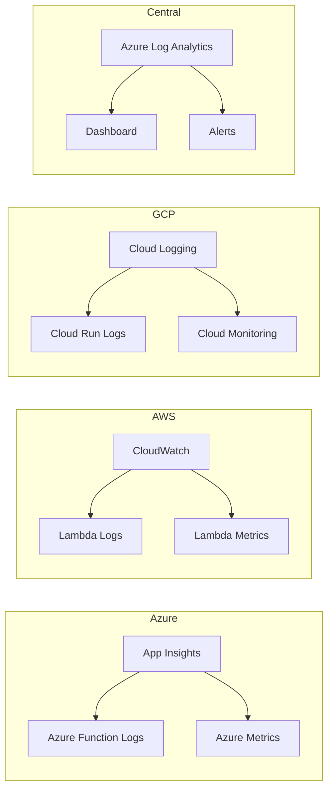
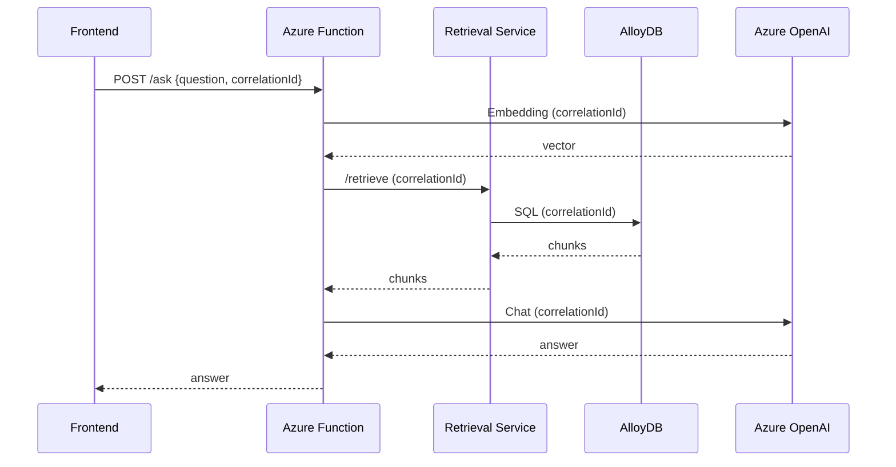

# 🔍 Observabilidad y Métricas Cross-Cloud – CODEA RAG

## 📌 Resumen

Este documento describe la estrategia de observabilidad implementada en la plataforma CODEA RAG, que abarca los tres proveedores cloud: **Azure**, **AWS** y **GCP**. Se detallan las herramientas utilizadas, las métricas recopiladas, la trazabilidad del flujo completo y los mecanismos de alerta y monitoreo.

---

## 🏗️ Arquitectura de Observabilidad

La observabilidad se organiza en tres capas:

1. **Logs:** Registros detallados de cada componente.
2. **Métricas:** Indicadores de rendimiento (latencia, errores, uso de recursos).
3. **Trazabilidad:** Seguimiento de una solicitud desde el frontend hasta la respuesta final.



* * *

## ☁️ Observabilidad por Proveedor

### 1\. Microsoft Azure

| Herramienta | Componente | Uso |
| --- | --- | --- |
| **Application Insights** | Azure Functions | Monitoreo de ejecuciones, tiempos de respuesta, errores y dependencias. |
| **Azure Monitor** | Functions, Static Web Apps | Métricas de CPU, memoria, solicitudes y logs de plataforma. |
| **Log Analytics** | Centralizado | Consulta de logs de Functions y Static Web Apps. |
| **Azure Portal (Logs)** | Function App | Logs en tiempo real (Log Streaming). |

#### Configuración de Application Insights

```json
// host.json (azure-function)
{
  "version": "2.0",
  "logging": {
    "applicationInsights": {
      "samplingSettings": {
        "isEnabled": true,
        "maxTelemetryItemsPerSecond": 5
      }
    }
  }
}
```

#### Métricas clave en Azure

| Métrica | Descripción | Umbral de alerta |
| --- | --- | --- |
| `Duration` | Tiempo de ejecución de la Function | \> 5 segundos |
| `Success Rate` | Porcentaje de ejecuciones exitosas | < 95% |
| `Requests` | Volumen de solicitudes | \- |
| `Errors` | Número de errores | \> 10 por hora |

* * *

### 2\. AWS (Lambda y S3)

| Herramienta | Componente | Uso |
| --- | --- | --- |
| **CloudWatch** | Lambda, S3 | Logs de ejecución, métricas de invocaciones, errores y duración. |
| **CloudTrail** | Lambda, S3 | Auditoría de acciones (subida de archivos, invocaciones). |
| **CloudWatch Logs** | Lambda | Logs detallados de cada ejecución. |

#### Configuración de logs en Lambda

```python

\# lambda\_function.py
import logging
logger \= logging.getLogger()
logger.setLevel(logging.INFO)
logger.info(f"Procesando archivo: {key}")
```

#### Métricas clave en AWS

| Métrica | Descripción | Umbral de alerta |
| --- | --- | --- |
| `Invocations` | Número de invocaciones | \- |
| `Errors` | Número de errores | \> 5 por hora |
| `Duration` | Tiempo de ejecución | \> 60 segundos |
| `Throttles` | Solicitudes limitadas | \> 0 |


* * *

### 3\. Google Cloud Platform (GCP)

| Herramienta | Componente | Uso |
| --- | --- | --- |
| **Cloud Logging** | Cloud Run, AlloyDB | Logs de contenedores y base de datos. |
| **Cloud Monitoring** | Cloud Run, AlloyDB | Métricas de CPU, memoria, latencia y errores. |
| **Cloud Trace** | Cloud Run | Trazabilidad de solicitudes (opcional). |

#### Configuración de logs en Cloud Run

```python

\# retrieval.py
import logging
logger \= logging.getLogger(\_\_name\_\_)
logger.setLevel(logging.INFO)
logger.info(f"Consulta ejecutada en {elapsed:.2f}s")
```

#### Métricas clave en GCP

| Métrica | Descripción | Umbral de alerta |
| --- | --- | --- |
| `CPU Utilization` | Uso de CPU del contenedor | \> 80% |
| `Memory Utilization` | Uso de memoria | \> 80% |
| `Request Latency` | Tiempo de respuesta | \> 2 segundos |
| `Error Rate` | Porcentaje de errores | \> 5% |


* * *

## 📊 Métricas de Rendimiento Cross-Cloud

### Latencia Total del Flujo (Azure → AWS → GCP → Azure)

| Paso | Componente | Tiempo promedio (ms) |
| --- | --- | --- |
| 1 | Frontend → Azure Function | 150 |
| 2 | Azure Function → Azure OpenAI (Embeddings) | 800 |
| 3 | Azure Function → GCP Retrieval Service | 300 (red) + 200 (procesamiento) |
| 4 | Retrieval Service → AlloyDB (consulta) | 150 |
| 5 | Retrieval Service → Azure Function (respuesta) | 300 (red) |
| 6 | Azure Function → Azure OpenAI (Chat) | 1,200 |
| 7 | Azure Function → Frontend (respuesta) | 150 |
| Total |  | ~3,250 ms (3.25 segundos) |

> Nota: Los tiempos pueden variar según la carga, la ubicación de los servicios y la red.

### Trazabilidad del Flujo

Para rastrear una solicitud completa, se utiliza un correlation ID generado en el frontend y pasado a través de todos los servicios:


Cada servicio registra el `correlationId` en sus logs, permitiendo un seguimiento completo.

* * *

## 📌 Alertas y Notificaciones

| Proveedor | Alerta | Canal |
| --- | --- | --- |
| **Azure**| Latencia > 5s en Function | Correo electrónico, Teams |
| **Azure** | Errores > 10/hora | Correo electrónico |
| **AWS** | Errores en Lambda > 5/hora | SNS (correo) |
| **GCP** | CPU > 80% en Cloud Run | Slack |
| **GCP** | Errores HTTP 500 > 5% | Correo electrónico |

* * *

## 📁 Dashboards Recomendados

-   **Azure Dashboard:** Panel con métricas de Functions (éxito/error, duración, solicitudes) y Application Insights (trazas de dependencias).
    
-   **AWS CloudWatch Dashboard:** Incluye gráficos de invocaciones de Lambda, errores y duración.
    
-   **GCP Cloud Monitoring Dashboard:** Panel con latencia de Cloud Run, uso de CPU/memoria, y consultas a AlloyDB.
    
-   **Dashboard Centralizado:** Usando Azure Log Analytics o Grafana (conectado a las tres nubes) para una vista unificada.
    

* * *

## 🧪 Pruebas de Observabilidad

-   **Prueba de Latencia:** Ejecutar 100 consultas y medir tiempos totales y por componente.
-   **Prueba de Errores:** Simular fallos en la base de datos y verificar que los logs capturen el error.
-   **Prueba de Trazabilidad:** Inyectar un `correlationId` y verificar que aparezca en los logs de todos los servicios.
    

* * *

## 📚 Documentación Relacionada

-   [Guía de Administrador](https://guia-administrador.md/) – Comandos para visualizar logs y métricas.
-   [Optimización de Costos](https://costos.md/) – Relación entre métricas y costos.
-   [README Principal](https://../README.md) – Visión general del proyecto.

* * *

Autor: David Yurvilca  
Fecha: Junio 2026  
Versión: 1.0